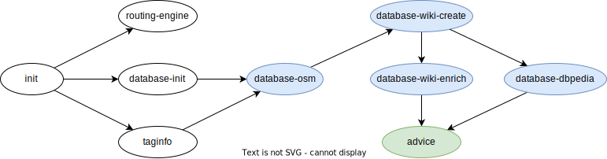
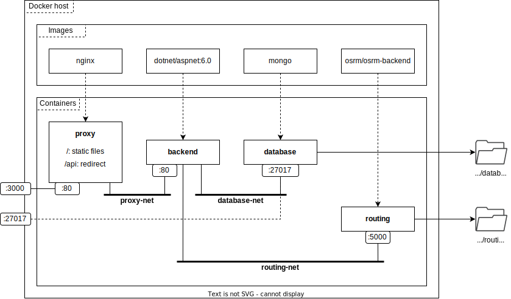

# Administrator's guide

[**Data preparation**](#data-preparation) provides a step-by-step procedure on how to integrate data from *six* different sources and prepare it for running SmartWalk.

Once data is ready, read [**Running the app**](#running-the-app) to learn how to get the application up and running in development and production settings.

If something is not working as expected, you might find [**Troubleshooting**](#troubleshooting) helpful before searching for a solution on the Web.

## System requirements

SmartWalk is essentially cross-platform. However, Unix utilities simplify certain aspects of system maintenance. We assume that the application will run on *Unix-like* environments, such as Linux or [Windows Subsystem for Linux](https://learn.microsoft.com/en-us/windows/wsl/about).

Please ensure that the following programs are installed on the target system:

- Docker
- .NET SDK v6.0
- Git
- GNU Bash, Make, Tar, and Wget
- Node.js v18.x (install via [nvm](https://github.com/nvm-sh/nvm#install--update-script))

!!! warning
    If mentioned, preserve versions of packages due to library dependencies.

Clone the repository with *submodules* and navigate to its root folder:

```bash
$ git clone --recurse-submodules https://github.com/zhukovdm/smartwalk.git
$ cd ./smartwalk/
```

**ADVICE:** Docker-related commands require the current user to be a member of the `docker` group to avoid using `sudo` (or similar) repeatedly. See details at [Manage Docker as a non-root user](https://docs.docker.com/engine/install/linux-postinstall/#manage-docker-as-a-non-root-user).

## Data preparation

This section explains how to prepare data for two system components: the [**Database**](#entity-store-and-index) (entity store and index) and the [**Routing engine**](#routing-engine).

!!! warning
    The complexity of extracting and building data structures depends on the size of a particular region and might be time- and resource-consuming, especially when processing `OSM` dumps.

### Initialization

Navigate to the `data` folder, assuming you are in the root folder of the `smartwalk` repository:

```bash
$ cd ./data/
```

Decide which part of the world you are interested in. Download the corresponding `pbf`-file at [Geofabrik](https://download.geofabrik.de/), and store it in the `./assets/osm-maps/` folder. As an example, the following command makes use of the `wget` utility to obtain the latest dump of the Czech Republic:

```bash
$ wget \
    -O ./assets/osm-maps/czech-republic-latest.osm.pbf \
    https://download.geofabrik.de/europe/czech-republic-latest.osm.pbf
```

Open `Makefile` and set the value of `REGION_FILE` accordingly. Some of the `OSM` dumps are quite large and additional refinement might be necessary. There are four variables `REGION_X`, where suffix `X` can be any of `W` (West), `N` (North), `E` (East), or `S` (South), defining a bounding box. Entities outside this box are filtered out. To switch off filtering, set `W=-180.0`, `N=85.06`, `E=180.0`, and `S=-85.06` (see [EPSG3857](https://epsg.io/3857) for details).

Create folders for storing data, and restore project dependencies:

```bash
$ make init
```

### Routing engine

Build a data structure for the routing engine:

```bash
$ make routing-engine
```

The command pulls [this Docker image](https://hub.docker.com/r/osrm/osrm-backend/) and builds the search structure in several consecutive phases. The results are stored in the `./assets/routing-engine/` folder.

**ADVICE:** An instance of OSRM backend is able to load [only one](https://help.openstreetmap.org/questions/64867/osrm-routed-for-multiple-countries) `osrm`-file at a time. This limitation can be overcome via merging (see [osmosis](https://gis.stackexchange.com/a/242880)).

**ADVICE:** It is possible to extract routing data for several regions and keep all files in the same folder as long as the original `pbf`-files have distinct names. Use [environment variables](#environment-variables) to select a part of the world on engine start.

### Entity store and index

Start up a [containerized](https://hub.docker.com/_/mongo/) database instance:

```bash
$ docker compose up -d
```

**ADVICE:** Enter `docker container ls` repeatedly to print out the list of existing containers. Wait until `smartwalk-database` is healthy.

Clean up all previous data, create new collections and indexes:

```bash
$ make database-init
```

Obtain the most popular `OSM` keys from [Taginfo](https://taginfo.openstreetmap.org/taginfo/apidoc) and store results in the `./assets/taginfo/` folder:

```bash
$ make taginfo
```

**ADVICE:** A list of tags can be extended by altering `Makefile`, although this is not enough to enable their full potential. The [constructor](https://github.com/zhukovdm/smartwalk/blob/fab346ac73f43be063b7e16d4f2c5f060e38ecfc/data/osm/KeywordExtractor.cs#L23-L53) of `KeywordExtractor` shall reflect changes as well. <u>Never remove</u> tags from the list as it may brake things unexpectedly. Modifying tag list is not a typical operation and may require deeper knowledge of the system.

Extract entities from the `pbf`-file:

```bash
$ make database-osm
```

As part of the procedure, the routine makes several `GET` requests to the [Overpass API](https://overpass-api.de/api/interpreter). A query is configured to time out after 100 seconds, though the server usually responds within the first 10.

**ADVICE:** To make queries feasible for the Overpass API, the selected bounding box is divided into smaller pieces. The recipe has two switches `--rows` and `--cols` defining the grid.

Create stubs for new entities from the [Wikidata](https://www.wikidata.org/wiki/Wikidata:Main_Page) knowledge graph:

```bash
$ make database-wikidata-create
```

The script attempts to fetch data from a SPARQL endpoint. Requests may time out after *one* minute. Large regions are more likely to result in failures. Hence, the numeric constants were specifically chosen for the test setup and may not be suitable for other cases.

**ADVICE:** The recipe has `--rows` and `--cols` switches with functionality similar to `database-osm`.

Enrich the current dataset with information from [Wikidata](https://www.wikidata.org/wiki/Wikidata:Main_Page):

```bash
$ make database-wikidata-enrich
```

Enrich the current dataset with information from the [DBPedia](https://www.dbpedia.org/about/) knowledge graph:

```bash
$ make database-dbpedia
```

Collect supporting data to aid autocomplete functionality:

```bash
$ make advice
```

Finally, stop the database instance:

```bash
$ docker compose down
```

All relevant files are stored in the `./assets/database/` folder.

### Incremental updates

The system supports incremental updates to incorporate new versions of datasets. It is possible to re-run blue-highlighted commands with no impact on data integrity. The programs are designed to update only defined properties without replacing entities, acting as an [idempotent](https://en.wikipedia.org/wiki/Idempotence#Idempotent_functions) function.

`advice` should be re-generated whenever the database state is altered.



### Dumping database

Dump the current database state:

```bash
$ make dump
```

The command creates `keyword.txt` and `place.txt` in the `./assets/dump/` folder.

If necessary, archive these files for publishing:

```bash
$ cd ./assets/dump/
$ tar -czf smartwalk-[kind]-[timestamp].tar.gz *.txt
```

### Restoring database

Clean up the database and restore the state from files:

```bash
$ make database-init && make restore
```

The `restore` procedure expects *both files* to be in the `./assets/dump/` folder. Otherwise, it fails.

Examples of archived dumps can be found [here](https://www.dropbox.com/scl/fo/phyv4l2649p3oqy4345wp/h?rlkey=jbg9obkzk6izoy8vlulveznq9&dl=0). Those having `prod` in their names are the most data-rich covering beautiful [Prague](https://en.wikipedia.org/wiki/Prague).

If necessary, unpack a downloaded archive as follows:

```bash
$ cd ./assets/dump/
$ tar -xzf smartwalk-[kind]-[timestamp].tar.gz
```

## Running the app

The purpose of this section is to explain how to start the system in development and production modes. We assume that you are in the root folder of the `smartwalk` repository and all relevant data have been extracted or restored and are available in their respective folders.

### Development environment

This environment is intended primarily for developers and testers. It enables controlling parts of the system independently.

There are *four* system components involved in the setup: the frontend, backend, database, and routing engine. The first two run directly in the terminal, while the last two are Docker containers. The table below summarizes their roles and the mapping of system ports.

| Component | Ports             | Role                                  |
|-----------|-------------------|---------------------------------------|
| database  | localhost:27017   | Entity store and index                |
| routing   | localhost:5000    | Routing engine                        |
| backend   | localhost:5017    | Application logic <s>(hot reload)</s> |
| frontend  | localhost:3000    | Static files (hot reload)             |

!!! note
    For convenience, components can be started and stopped directly from the `smartwalk` root folder. Please refer to [Makefile](https://github.com/zhukovdm/smartwalk/blob/main/Makefile). Recipe names follow the pattern `[component_name]-dev[-stop]`.

#### Database

Start and stop an instance of database using `database-dev[-stop]` from `Makefile`.

#### Routing engine

Start and stop an instance of routing engine using `routing-dev[-stop]` from `Makefile`.

Set `OSRM_REGION_FILE` in [.env.development](https://github.com/zhukovdm/smartwalk/blob/main/infra/.env.development) to load a region other than the Czech Republic.

#### Backend

The project is located in `./app/backend/`. Run `dotnet run` from there to start the backend in the terminal, and stop it by pressing `Ctrl+C`. Read more about other commands in [README.md](https://github.com/zhukovdm/smartwalk/blob/main/app/backend/README.md).

!!! warning
    This component requires the `database` to be up and running. Otherwise, it fails to start.

The source code uses `SMARTWALK_MONGO_CONN_STR` and `SMARTWALK_OSRM_BASE_URL` environment variables. Adjust [launchSettings.json](https://github.com/zhukovdm/smartwalk/blob/main/app/backend/SmartWalk.Api/Properties/launchSettings.json) respectively if you wish to alter the default port configuration.

#### Frontend

Find the project in `./app/frontend/`. Run `npm start` from there to start the frontend in the terminal, and stop it by pressing `Ctrl+C`. Learn more about other commands in [README.md](https://github.com/zhukovdm/smartwalk/blob/main/app/frontend/README.md).

The source code uses `REACT_APP_SMARTWALK_API_ORIGIN` environment variable. Set its value in the [.env.development](https://github.com/zhukovdm/smartwalk/blob/main/app/frontend/.env.development) file if you wish to run backend on another port.

### Production environment

This environment is a tightly coupled bundle consisting of four interconnected Docker containers; its detailed schema is shown in the picture below.



!!! note
    The `database` exposes port `27017` for manual diagnostic and performance testing. Hide it if none of the mentioned reasons is your case.

Start and stop production environment from the root folder of the repo:

```bash
$ make prod[-stop]
```

**ADVICE:** All containers implement healthcheck, run `docker container ls` to see their state.

The respective environment variables are defined in the [.env.production](https://github.com/zhukovdm/smartwalk/blob/main/infra/.env.production) file.

## Troubleshooting

<font size="4">**WSL runs out of memory**</font>

If your `WSL` consumes too much memory, Windows might suddenly terminate the entire process without prior notice. Try to mitigate the issue by extending the swap file; set `swap=XXGB` in the `.wslconfig` file. For more details, see [Example .wslconfig file](https://learn.microsoft.com/en-us/windows/wsl/wsl-config#example-wslconfig-file).

<font size="4">**A container starts for too long**</font>

If any of the containers is unhealthy or starting for too long (healthcheck has failed repeatedly on the background), replace `[container_name]` placeholder by the name of a problematic instance and press `Enter` to find out the reason:

```bash
$ docker container ls -a

CONTAINER ID   IMAGE                    ...   NAMES
...            ...                      ...   ...
377fe35d4472   smartwalk/proxy:v1.0.0   ...   smartwalk-proxy
...            ...                      ...   ...

$ docker inspect --format "{{json .State.Health }}" [container_name]
```

<font size="4">**Nothing seems to help**</font>

If the system does not work properly and you do not know what to do, clean up files and start from scratch. As the first step, remove *SmartWalk* images:

```bash
$ docker image rm smartwalk/proxy
$ docker image rm smartwalk/backend
$ docker image rm smartwalk/routing
```

Clean up unused Docker files (cached build files, dangling images and volumes, etc.):

!!! warning
    Use this command with caution as it may introduce undesired changes into your Docker host. Read about side effects [here](https://docs.docker.com/engine/reference/commandline/system_prune/).

```bash
$ docker system prune --volumes
```
