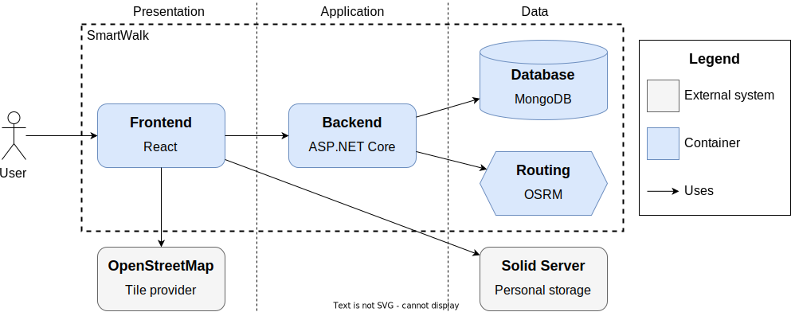
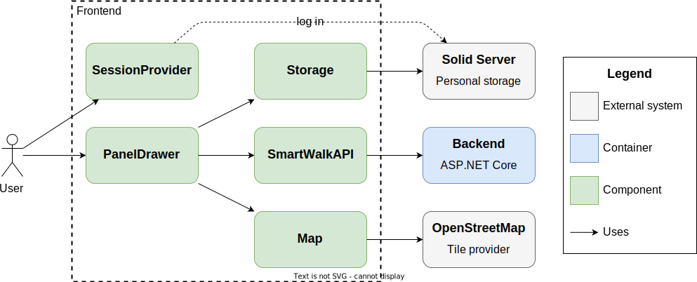
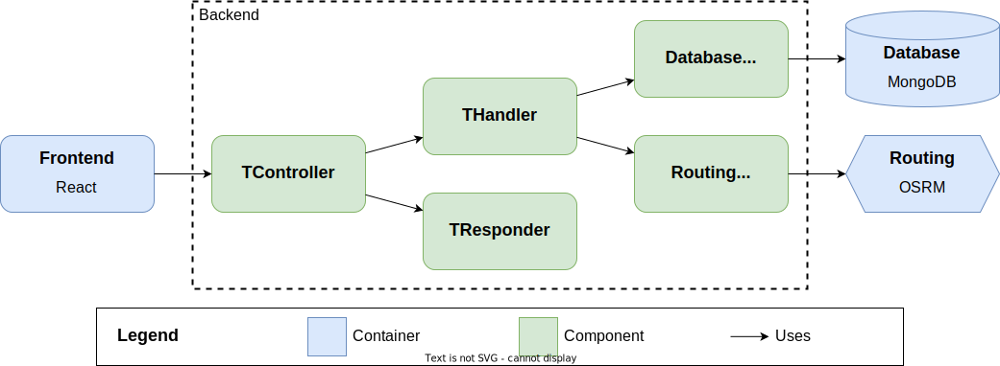

# Programmer's guide

This guide introduces the main parts of the application and provides sufficient implementation details to ensure a gentle learning curve for novice contributors.

## Prerequisites

To acquire the tools necessary for setting up the environment, preparing the dataset, and writing and testing source code, follow the steps outlined in [**Prerequisites**](./adm.md#prerequisites).

## Environment

Learn more about the development environment at [**Running the app**](./adm.md#running-the-app). This section explains how to configure, start, and terminate individual parts of the system.

## Repository structure

The repository has the structure depicted below. Please note that the list is *not* exhaustive.

```txt
./
├── Makefile . . . . . . . . . . . . . . . . . . . . . . . . . . . . . . . System maintenance
├── app/
│   ├── backend/  . . . . . . . . . . . . . . . . . . . . . . . . . . . . Web API application
│   │   ├── Dockerfile . . . . . . . . . . . . . . . . . . . . . . *backend* image definition
│   │   ├── README.md
│   │   ├── SmartWalk.Api/ . . . . . . . . . . . . . . . . . . . . . . . . Presentation layer
│   │   ├── SmartWalk.Application/ . . . . . . . . . . . . . . . . . . . Handlers (use cases)
│   │   ├── SmartWalk.Core/  . . . . . . . . . . . . . . . . . . . . . . . . . . Domain logic
│   │   ├── SmartWalk.Infrastructure/ . . . . . . . . . . . . . . . . . Infrastructural nodes
│   │   ├── SmartWalk.<Project>.Test/ . . . . . . . . . . . . . . . . . . . . Automated tests
│   │   ├── WolfGarbe.PruningRadixTrie/ . . . . . . . . . . . . . . . . . External dependency
│   │   └── ...
│   └── frontend/ . . . . . . . . . . . . . . . . . . . . . . . . . . Single-page application
│       ├── Dockerfile . . . . . . . . . . . . . . . . . . . . . . . *proxy* image definition
│       ├── README.md
│       ├── config/
│       │   └── nginx/  . . . . . . . . . . . . . . . . . . . . . . . . . Nginx configuration
│       ├── public/  . . . . . . . . . . . . . . . . . . . . . . . . . . . . . . Static files
│       └── src/
│           ├── components/  . . . . . . . . . . . . . . . . . . . . . . . . React components
│           │   ├── __tests__/ . . . . . . . . . . . . . . . . . . . . . . Nested test folder
│           │   │   └── PanelDrawer.test.tsx
│           │   └── PanelDrawer.tsx
│           ├── domain/  . . . . . . . . . . . . . . . . . . . . . . . . Types and interfaces
│           └── features/  . . . . . . . . . . . . . . . . . . . . . . . . . Hooks and slices
├── data/  . . . . . . . . . . . . . . . . . . . . . . . . . . . . . . . . . . Data pipelines
├── infra/  . . . . . . . . . . . . . . . . . . . . . . . . . . . . . . . . Environment files
│   └── backend/
└── misc/ . . . . . . . . . . . . . . . . . . . . . . . . . . . . . . . . . . . . Miscellanea
```

## Architecture

The architecture of the application is demonstrated using elements of the [C4 model](https://c4model.com/). *SmartWalk* is composed of *four* interconnected containers: the `Frontend`, `Backend`, `Database`, and `Routing`. The first two are containerized applications from the `./app/` folder. The last ones are containers based on [osrm-backend](https://hub.docker.com/r/osrm/osrm-backend) and [mongo](https://hub.docker.com/_/mongo) Docker images that supply business logic with actual data.



## Frontend

The frontend is a React-based single-page application, serving as an entry point and offering a rich user experience. Its source code is located in the `./app/frontend/`.

The code documentation generated by [TypeDoc](https://typedoc.org/) is available at [**dev-frontend**](https://zhukovdm.github.io/smartwalk-docs/dev-frontend/).

The following abstractions carry out the intended functionality.



`Map` is responsible for loading tiles and drawing markers and vector geometries on a map. The `LeafletMap` is a concrete implementation capable of interacting with the `OSM` map.

`Storage` is an abstraction that unifies methods for accessing both device storage and decentralized Solid pod. Data are stored on a device in IndexedDB, a standardized in-browser database, with the help of the `DeviceStorage` and pushed to a pod by the `SolidStorage`.

`SmartWalkAPI` is a set of functions defined in the `smartwalk.ts` file for retrieving data from the backend via HTTP protocol.

Finally, the `PanelDrawer` and `SessionProvider` are React components with visual part. The former implements the panel-based user interface and client-side routing, while the latter ensures the Solid login dialog and handles the proper switch over to the `Solid Session` panel.

*Please note that IndexedDB and a Solid pod are mutually exclusive storages.*

To keep panel state and resolve storage read operations *locally*, we use the Redux Toolkit state container composed of *slices*. A distinct slice is implemented for each panel, see files ending with `Slice.ts` in the `./src/features/` folder.

Redux Toolkit is not recommended for keeping non-serializable data, such as class instances. For this reason, `Map`, `Storage`, and cached backend responses are stored in the standard Context API.

Standard React hooks were found to be insufficient to cover the needs of the application. For custom hooks, see source files whose names end with `Hooks.ts` in the `./src/features/` folder.

## Backend

All searching and planning functionality resides within the backend.



Code documentation generated by [Doxygen](https://www.doxygen.nl/) is available at [**dev-backend**](https://zhukovdm.github.io/smartwalk-docs/dev-backend/).

### HTTP endpoints

All The project uses standardized OpenAPI

Swagger documentation is available at [swagger.yaml](http://localhost:5017/swagger/v1/swagger.yaml) whenever `Backend` container is up and running or at [SwaggerHub](https://app.swaggerhub.com/apis/zhukovdm/smartwalk/).

**GET /api/advice/keywords** <br>
&emsp;&emsp;&emsp; suggests up to `count` relevant keywords for a given `prefix`.

**GET /api/search/routes, /places, /direcs** <br>
&emsp;&emsp;&emsp; handle entity search queries and accept `query` parameter.

**GET /api/entity/places/{smartId}** <br>
&emsp;&emsp;&emsp; gets the full representation of a place by identifier.

**ADVICE:** Unfortunately, not all endpoints provide examples. To support caching, *search* queries and category definitions are passed around as serialized and percent-encoded JSON objects. Their internal structure is given in [routes.json](https://github.com/zhukovdm/smartwalk/tree/main/misc/query/routes.json), [places.json](https://github.com/zhukovdm/smartwalk/tree/main/misc/query/places.json), and [direcs.json](https://github.com/zhukovdm/smartwalk/tree/main/misc/query/direcs.json). Alternatively, you could refer to type definitions.

### SmartWalk.Api

?

### SmartWalk.Application

`TController`, then `THandler`, then `EntityStore`

### SmartWalk.Infrastructure

?

### SmartWalk.Core

?

## Data pipelines

Besides the application source code, there are small task-oriented programs in the `./data/` folder to carry out the [**Data preparation**](./adm.md#data-preparation) phase.

- `taginfo/` loads key statistics from Taginfo into key-specific .json files.

- `osm/` combines information stored in Taginfo files, OSM binary files, and fetched from Overpass API to create new places or update existing ones.

- `wikidata-create/` creates simple stubs for places that do not exist yet.

- `wikidata-enrich/` updates the current dataset with the latest information from the Wikidata knowledge graph.

- `dbpedia/` does the same action as `wikidata-enrich/` but for DBPedia.

- `advice/` collects statistics about keywords and attributes across the dataset and recreates advice items.

- `dump/` dumps places and keywords into `.txt` files.

- `restore/` restores place and keyword collections from `.txt` dump files.

## Testing

Tests for frontend functions and components are located in nested `__tests__/` folders. To run them, navigate to the `./app/frontend` folder and enter:

```bash
$ npm run tests
```

To run backend tests, navigate to the `./app/backend/` folder and enter:

```bash
$ dotnet test
```
