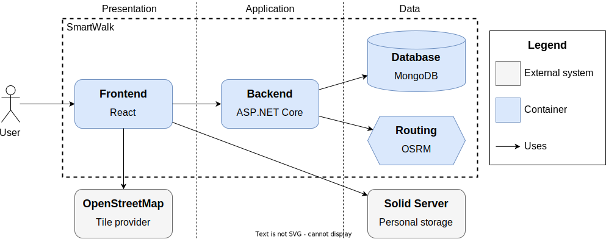

# Programmer's guide

The goal of this guide is to provide a high-level overview of the project structure, introduce the main parts of the system and abstractions, and eventually ensure a gentle learning curve.

## Prerequisites

To acquire the tools necessary for development, follow the steps outlined in [**Prerequisites**](./adm.md#prerequisites). Then, choose a text editor that supports syntax highlighting and suggestions for [TypeScript](https://www.typescriptlang.org/) with [JSX](https://react.dev/learn/writing-markup-with-jsx) extension and [C\#](https://learn.microsoft.com/en-us/dotnet/csharp/) programming languages.

## Repository structure

The repository has roughly the following structure. Please note that the list is not exhaustive.

```txt
.
├── Makefile . . . . . . . . . . . . . . . . . . . . . . . . . Recipes for system maintenance
├── app/
│   ├── backend/  . . . . . . . . . . . . . . . . . . . . . . . . . . . . Web API application
│   │   ├── Dockerfile
│   │   ├── Doxyfile
│   │   ├── README.md
│   │   ├── SmartWalk.Api/ . . . . . . . . . . . . . . . . . . . . . . . . Presentation layer
│   │   ├── SmartWalk.Application/ . . . . . . . . . . . . . . . . . . . Handlers (use cases)
│   │   ├── SmartWalk.Core/  . . . . . . . . . . . . . . . . . . . . . . . . . . Domain logic
│   │   ├── SmartWalk.Infrastructure/ . . . . . . . . . . . . . . . . . Infrastructural nodes
│   │   ├── SmartWalk.<Project>.Test/  . . . . . . . . . . . . . . . . . . . . . . Unit tests
│   │   └── WolfGarbe.PruningRadixTrie/ . . . . . . . . . . . . . . . . . External dependency
│   └── frontend/ . . . . . . . . . . . . . . . . . . . . . . . . . . Single-page application
│       ├── Dockerfile
│       ├── package.json
│       ├── README.md
│       ├── tsconfig.json
│       ├── typedoc.json
│       ├── config/ . . . . . . . . . . . . . . . . . . . . . . . . Nginx configuration files
│       ├── public/  . . . . . . . . . . . . . . . . . . . . . . . . . Icons, main page, etc.
│       └── src/  . . . . . . . . . . . . . . . . . . . . . . . . . . . . . React application
├── data/  . . . . . . . . . . . . . . . . . . . . . . . . . . . . . . . . . Data preparation
│   ├── docker-compose.yaml
│   ├── Makefile
│   ├── advice/ . . . . . . . . . . . . . . . . . . . . . . . . Collect data for autocomplete
│   ├── assets/
│   ├── dbpedia/  . . . . . . . . . . . . . . . . . . . . . . . . . . Pipeline for DBPedia KG
│   ├── dump/ . . . . . . . . . . . . . . . . . . . . . . . Dump database state to text files
│   ├── init/  . . . . . . . . . . . . . . . . . . . . . . Create folders, restore deps, etc.
│   ├── osm/  . . . . . . . . . . . . . . . . . . . . . . . . . Pipeline for binary OSM files
│   ├── restore/ . . . . . . . . . . . . . . . . . . . Restore database state from text files
│   ├── shared/  . . . . . . . . . . . . . . . . . . . . . . . . . . . . Shared functionality
│   ├── taginfo/ . . . . . . . . . . . . . . . . . . . . . . . . . . Pipeline for Taginfo API
│   ├── wikidata-create/ . . . . . . . . . . . . . . . . . . . . . . Pipeline for Wikidata KG
│   └── wikidata-enrich/ . . . . . . . . . . . . . . . . . . . . . . Pipeline for Wikidata KG
├── infra/ . . . . . . . . . . . . . . . . . . . . . . . . (?)
│   ├── .env.development
│   ├── .env.production
│   ├── Dockerfile.routing
│   ├── docker-compose.development.database.yaml
│   ├── docker-compose.development.routing.yaml
│   └── docker-compose.production.yaml
└── misc/
    ├── contneg/ . . . . . . . . . . . . . . . . . . . . . . . . . . . KG content negotiation
    ├── ellipse/ . . . . . . . . . . . . . . . . . . . . . . . . . . . . . . Bounding ellipse
    ├── epsg/  . . . . . . . . . . . . . . . . . . . . . . . . . . WGS84 to/from Web Mercator
    ├── perf/ . . . . . . . . . . . . . . . . . . . . . . . . . . . . . . . Performance tests
    └── query/ . . . . . . . . . . . . . . . . . . . . . . . . JSON-schema for search queries
```

## Architecture

The architecture of the application is demonstrated using elements of the [C4 model](https://c4model.com/). *SmartWalk* is composed of *four* interconnected containers: the `Frontend`, `Backend`, `Database`, and `Routing`. The first two are containerized applications from the `./app/` folder. The last ones are [osrm-backend](https://hub.docker.com/r/osrm/osrm-backend) and [mongo](https://hub.docker.com/_/mongo) images from Docker Hub.

`OpenStreetMap` and `Solid Server` are external software systems used by the `Frontend` in a way that is explained below.



## Frontend

Code documentation generated by [TypeDoc](https://typedoc.org/) is available at [**dev-frontend**](https://zhukovdm.github.io/smartwalk-docs/dev-frontend/).


### State management

Redux container for serializable data and Context API for non-serializable.

### Data storages

Two kinds of data storages are supported: device storage and Solid pods. The former is , and the latter is a concept emerged recently.

Solid storage

## Backend

Code documentation generated by [Doxygen](https://www.doxygen.nl/) is available at [**dev-backend**](https://zhukovdm.github.io/smartwalk-docs/dev-backend/).

### SmartWalk.Api

All The project uses standardized OpenAPI

**GET /advice/keywords/**

**GET /search/routes, places/, direcs/** handle entity search queries and accept `query` parameter.

**GET /entity/places/{smartId}** gets the full representation of a place by identifier.

Once the backend is up and running 

Swagger documentation is available at [localhost](http://localhost:5017/swagger/index.html) whenever backend container is up and running or at [SwaggerHub](https://app.swaggerhub.com/apis/zhukovdm/smartwalk/).

Unfortunately, not all endpoints provide examples. Due to the statelessness of the backend to enable caching, search queries are represented as percent-encoded serialized JSON objects. Detailed information regarding their internal structure is given in the following JSON-schema files: [](), [](), and [](). Alternatively, you could refer to type definitions [](), [](), and []().

### SmartWalk.Application

`TController`, then `THandler`, then `EntityStore`

### SmartWalk.Infrastructure

?

### SmartWalk.Core

?

## ETL pipelines

`./data/` folder their meaning is roughly explained in there.

```js
const e = await pipeline.e(new Source(...));
const t = await pipeline.t(e);
const l = await pipeline.l(new Target(...), t);
```

## Test environment

Learn more about the development environment at the [**link**](./adm.md#development-environment). This guide explains how to configure and control individual parts of the system to achieve desired behavior.
