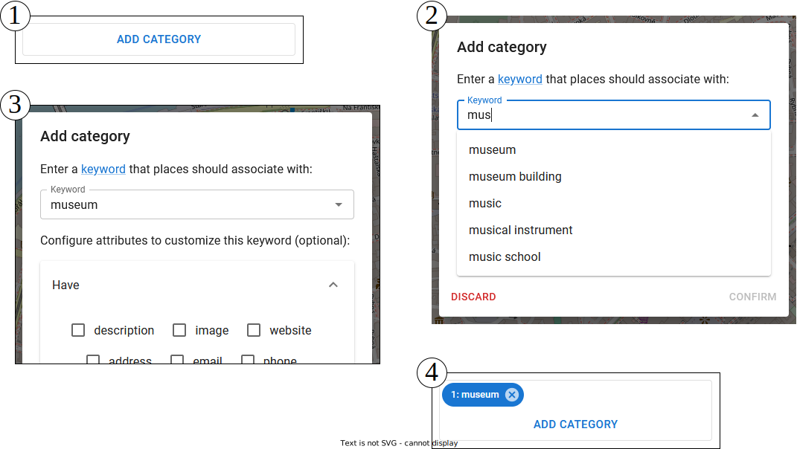

# User's documentation

## Route search

Navigate to the panel for searching routes:

Add a starting point and destination either on the map or one of your `Favorites`.

**ADVICE:** Custom points added directly on the map (not `Favorites`) are *movable*.

Add categories that should appear on a route:

If necessary, order categories by arrows:

Once all input parameters are, the panel might look like in the picture below. Press `Search` to initiate a request.

The result of a route search should be similar to the one depicted below.

If necessary, save a selected route with a custom name:

**ADVICE:** The route can be *modified* by copying its waypoints into the [**direction**](./usr.md#direction-search) sequence.

## Place search

To search places, follow a similar procedure. Navigate to the `Places` panel. Select a center point, set a radius of the circle, and add optional categories. If no category is specified, the system will attempt to retrieve *all* matching places within the circle.

The result of a place search is shown below.

Navigate to the detailed view of a place by clicking the blue link.

**ADVICE:** A place can be stored with a *custom* name or appended to the current [**direction**](./usr.md#direction-search) sequence. Use the menu accessible via the button with three dots.

## Direction search

Directions are searched in the same manner as the previous two types of entities. Add at least two points into the sequence and press `Search`.

Once the backend responds, paginated results are shown in the panel.

## Favorites

All stored entities (routes, places, and directions) appear in the `Favorites` panel. Basic operations, including view, edit, append (or modify), and delete, are available from the drop-down menu.

**ADVICE:** Create custom place (home, work, etc.) with a name and location via the simple dialog in the `My Places` collapsible region.

## Solid pod (advanced)

Normally, personal data are stored locally on a device. The application supports decentralized Solid pods. This is an advanced feature. Solid enables you to regain true data ownership.

Navigate to [https://solidproject.org/about](https://solidproject.org/about) if you wish to learn more about Solid technology.

Currently, *SmartWalk* supports Inrupt PodSpaces, which is an enterprise Solid implementation in *Developer Preview*. The application has also been tested against Community and Node Solid servers, yielding positive outcomes.

Create a Solid pod at [https://start.inrupt.com/profile](https://start.inrupt.com/profile).

Then, login against a Solid server, allow the application to access your pod, and wait until the `Solid Session` panel is opened.

Now, the application is connected to the server. Select a Solid pod from the drop-down list, and press the `Activate Pod` button. The application will initialize the pod, redirect to the `Favorites` panel, and download entities into the local state.

After that you may use the Solid pod as if it were device storage.

To logout, press `Solid` button in the right upper corner, and then the `Log out` button.
