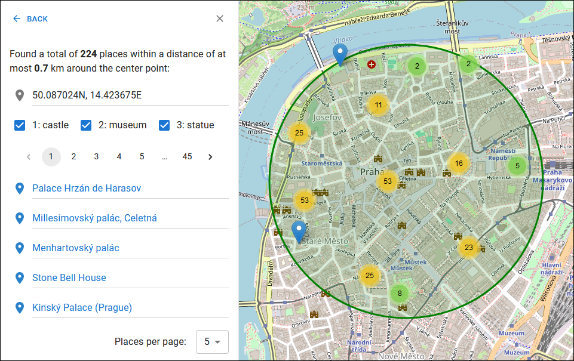

# User's documentation

The application provides the same level of user experience on *desktop* and *mobile* devices.

## Route search

Navigate to the panel for searching routes:

Add a starting point and destination either on the map or one of your `Favorites`:

Custom points added directly on the map (not one of the `Favorites`) are *movable*. Furthermore, you can clean up an occupied slot or swap points.

Add categories of places that should appear on any found route:

A category is composed of a keyword and keyword-specific attribute filters. The application will match only places associated with the keyword and that satisfy all activated attribute filters.

There are *five* possible types of attribute filters: existential (shown in the picture above), boolean, numeric, textual, and include/exclude.

To edit a category, click on its name. Press the `x` button to delete the category.

If necessary, order the categories using arrows:

Once all input parameters are set, press `Search` to initiate a request:

The result of a route search should have a structure similar to the one depicted below:

You may (un-)hide points associated with a category by toggling the corresponding checkbox.

If necessary, save the selected route with a custom name:

The route can be *modified* by copying its waypoints into the [**direction**](./usr.md#direction-search) sequence.

## Place search

To search for places, follow a similar procedure. Navigate to the `Places` panel, select a center point, adjust the circle's radius, and optionally add categories. If no category is specified, the system will attempt to retrieve *all* matching places within the circle.

The result of a place search is shown below.

Navigate to the detailed view of a place by clicking the blue link.

A place can be stored with a *custom* name or appended to the current [**direction**](./usr.md#direction-search) sequence. Use the menu accessible via the three-dot button.

## Direction search

Directions are searched in the same manner as the previous two types of entities. Add at least two points to the sequence and press `Search`.

After receiving a response from the backend, paginated results are displayed in the panel.

## Favorites

All stored entities (routes, places, and directions) appear in the `Favorites` panel. Basic operations, such as view, edit, append (or modify), and delete, are available from the drop-down menu.

Create a custom place (home, work, etc.) with a name and location through the simple dialog in the `My Places` collapsible region.

## Solid pod (advanced)

By default, personal data is stored locally on your device in [IndexedDB](https://developer.mozilla.org/en-US/docs/Web/API/IndexedDB_API), a standardized in-browser database. Additionally, the application supports *external* Solid pods.

Solid enables you to regain true data ownership. Learn more about this technology at

  <a href="https://solidproject.org/about">https://solidproject.org/about</a>.

*SmartWalk* supports [Inrupt PodSpaces](https://ap.inrupt.com/) out of the box, which is currently in Developer Preview. The application has also been tested on [Community](https://github.com/CommunitySolidServer/) and [Node](https://github.com/nodeSolidServer/) Solid servers, yielding positive outcomes.

<strong>(!)</strong> The application assumes that your data is stored in the `${storage-root}/smartwalk/` container.

Create a profile and Solid pod at [https://start.inrupt.com/profile](https://start.inrupt.com/profile).

Log in to a Solid server, grant the application access to your pod, and wait until the `Solid Session` panel is opened.

Now, the application is connected to the server. Select a Solid pod from the drop-down list and press the `Activate Pod` button. The application will initialize the pod, redirect to the `Favorites` panel, and download entities into the local state.

After that, you can use your Solid pod as if it were device storage.

To log out, press the `Solid` button in the upper right corner, and then click the `Log Out` button.
